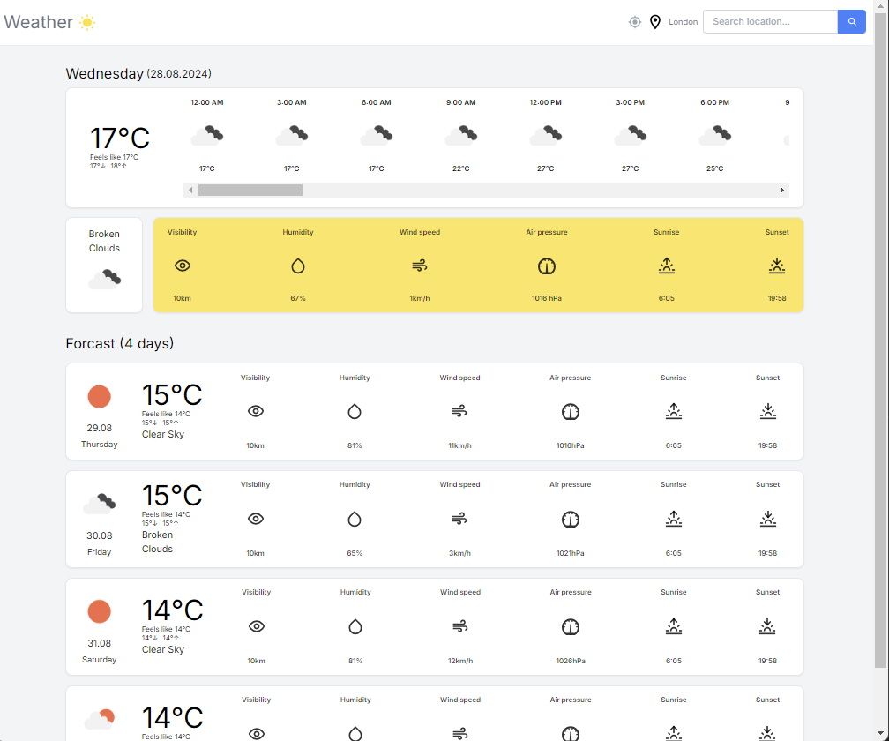
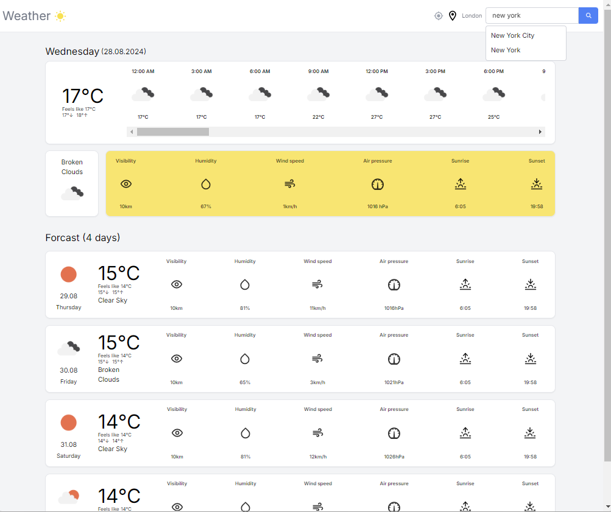

# Weather Forecast Application

## Overview

This is a weather forecasting application built with **Next.js** and **React Query**. The app allows users to search for and view detailed weather forecasts for various locations. It also supports geolocation to fetch the user's current weather. The data is fetched from the OpenWeatherMap API, and the application provides both current weather and a 7-day forecast.

## Features

- **Search for Weather**: Users can search for weather forecasts by entering a city name.
- **Current Location Weather**: The app can fetch and display the weather for the user's current location using geolocation.
- **7-Day Forecast**: View detailed weather information for the next 7 days.
- **Responsive Design**: The app is fully responsive and works well on both desktop and mobile devices.
- **Skeleton Loading**: Loading states are handled with skeleton screens to enhance user experience.

## Technologies Used

- **Next.js**: A React framework for building server-side rendered (SSR) and static web applications.
- **React Query**: For data fetching, caching, and synchronization.
- **Jotai**: A minimalistic state management library.
- **TypeScript**: Provides static typing to improve code quality and maintainability.
- **Axios**: For making HTTP requests to the OpenWeatherMap API.
- **Tailwind CSS**: For styling the components in a modern and responsive way.
- **Date-fns**: A modern JavaScript date utility library for date formatting and manipulation.

## Project Structure

```plaintext
weather-forecast-app/
├── src/components/                # Reusable React components
│   ├── Container.tsx
│   ├── Navbar.tsx
│   ├── SearchBox.tsx
│   ├── WeatherDetails.tsx
│   ├── WeatherIcon.tsx
│   ├── WeatherSkeleton.tsx
│   ├── ForcastWeatherDetail.tsx
│   └── SuggestionBox.tsx
├── src/utils/                     # Utility functions and types
│   ├── cn.ts
│   ├── convertKelvinToCelsius.ts
│   ├── formatDate.ts
│   ├── formatDay.ts
│   ├── getDayOrNightIcons.ts
│   ├── metersToKilometers.ts
│   ├── meterPerHourToKilometerPerHour.ts
│   ├── types.ts
│   └── dummyWeatherData.ts
├── src/app/                   # Global state and configuration
│   ├── atom.ts                # Jotai state atoms
│   ├── layout.tsx             # Main layout for the app
│   └── globals.css            # Global styles
│   └── page.tsx               # Home page
├── .env.local                 # Environment variables
├── README.md                  # Project documentation
├── tsconfig.json              # TypeScript configuration
├── package.json               # Project dependencies and scripts
└── tailwind.config.ts         # Tailwind CSS configuration
```

## Setup and Installation

### Prerequisites

- **Node.js** (v14.x or later)
- **npm** or **yarn** package manager

### Steps to Run the Project

1. **Clone the Repository**

   ```bash
   git clone https://github.com/TOSKY94/WeatherApp.git
   cd weather-forecast-app
   ```

2. **Install Dependencies**

   Using npm:

   ```bash
   npm install
   ```

   Or using yarn:

   ```bash
   npm install
   ```

3. **Set Up Environment Variables**
   Create a `.env.local` file in the root of your project with the following content:

   ```bash
   NEXT_PUBLIC_WEATHER_KEY=your_openweathermap_api_key
   ```

   Replace `your_openweathermap_api_key` with your actual OpenWeatherMap API key.

4. **Run the Development Server**

   Using npm:

   ```bash
   npm run dev
   ```

   Or using yarn:

   ```bash
   yarn dev
   ```

   The application will start on `http://localhost:3000`

## Usage

- **Search for a City**: Type the name of the city into the search bar and select it from the suggestions.
- **Use Current Location**: Click the location icon to fetch weather data for your current location.
- **View Weather Details**: The home page displays detailed weather information including temperature, humidity, wind speed, and a 7-day forecast.

## Deployment

To deploy the application, follow these steps:

1. **Build the Project**

   Using npm:

   ```bash
   npm run build
   ```

   Or using yarn:

   ```bash
   yarn build
   ```

2. **Start the Production Server**

   Using npm:

   ```bash
   npm start
   ```

   Or using yarn:

   ```bash
   yarn start
   ```

3. **Deploy to Vercel**
   You can deploy this application easily to Vercel. Simply push your code to GitHub and link your repository to Vercel. Vercel will handle the rest.

## User Interface

### Home page



#### Location search



## Contributing

Contributions are welcome! Please follow these steps:

1. Fork the repository.
2. Create a new branch (git checkout -b feature/your-feature-name).
3. Make your changes.
4. Commit your changes (git commit -m 'Add some feature').
5. Push to the branch (git push origin feature/your-feature-name).
6. Open a pull request.
